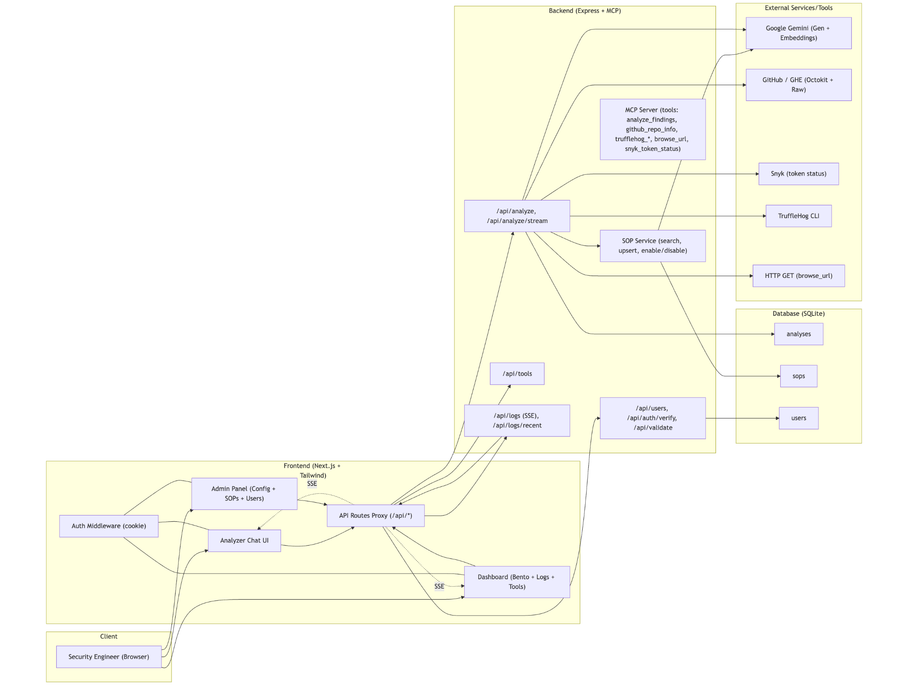

# Project Guardian 2.0 — Deployment Strategy (Nidhi Sahu)

## Goal
Block PII leakage from logs, payloads, and internal tools **without noticeable latency** and with **progressive coverage** across Flixkart’s estate.

## Summary of Approach
Use a **defense-in-depth** pattern with three layers:

1. **Edge Redaction (Primary):** An **API Gateway/Ingress plugin** (Envoy WASM filter or NGINX Lua) that detects & masks PII in **requests, responses, and access logs** *before* they enter shared infra or observability backends.
2. **Service Mesh / Sidecar (Targeted):** A **Sidecar container** for services handling sensitive data. It redacts PII in stdout/stderr logs and structured app logs (JSON), and offers a lightweight **gRPC filter** that app code can call for redaction on critical paths.
3. **Stream DLP (Ecosystem):** A **Kafka/Flink** stream processor that scans topics (ingress logs, audit events) and rewrites/masks messages to **PII-safe topics** for downstream consumers (SIEM, data lake).

> Default policy: **Deny PII egress to shared infra**, allow only masked variants.

---

## Where the Code Lives
- **WASM/Lua Filter** in the **Ingress Gateway (Envoy/NGINX Ingress Controller)** inside Kubernetes.
- **Sidecar** deployed via a **mutating admission webhook** to target namespaces. Ships with our Python detector (`detector_full_nidhi_sahu.py`) compiled to a **Python zipapp** or **PyOxidizer**-built binary for fast cold starts.
- **Flink Job** (Scala/Java) for Kafka streams (low-latency operators, ~5–15 ms).

---

## Data Flow

### 1) API Edge (Lowest Latency, Broadest Coverage)
- **Hook points:**
  - Request/Response body (size-capped; large bodies stream-chunked with incremental matching)
  - Headers
  - Access logs
- **Action:**
  - Detect **standalone PII** (phone, Aadhaar, passport, UPI) directly via regex DFAs.
  - Maintain a rolling **window** of tokens for **combinatorial PII** (email+name, email+address, ip/device+email).
  - Mask before emitting logs or forwarding to internal LB/mesh.
- **Why here?** Prevents tainted data from landing in logs/traces in the first place; **~sub‑millisecond** per KB with precompiled regex + Aho–Corasick tokenization.

### 2) Sidecar (Service-Level Control)
- Intercepts **stdout/stderr** and structured logs (JSON) using a local **fluent-bit** tailer that invokes the redactor over **UDS** (Unix Domain Socket).
- Provides a small **gRPC service** (`/redact`) for app code to call in hot paths when needed.
- Ships rule bundles as **versioned config** in a **ConfigMap** with hot reload.

### 3) Stream DLP (Kafka/Flink)
- Topics: `ingress.raw` → `ingress.redacted`, `audit.raw` → `audit.redacted`.
- Guarantees **at-least-once** with idempotent producers; DLQ for undecodable payloads.
- Backfills historical logs before sharing with analysts.

---

## K8s Footprint & Ops

- **Ingress**: Envoy Gateway with a **WASM HTTP filter** mounted from an image. Configured via a custom **CRD (`PIIRuleSet`)**.
- **Sidecar**: Injected by namespace label `pii-guard=enabled`. Daemon uses **gVisor**/seccomp profile and runs as non-root. CPU/mem HPA based on QPS and tail lag.
- **Config**: Rules ship as **CRDs** with canary fields (`percent`, `shadow_mode`). All changes logged and signed.
- **Observability**: Export **PII detection metrics** (`pii_hits_total{type=...}`, `false_positive_rate`) to Prometheus; traces sampled to 0.1% on hits.
- **Latency Budget**:
  - Edge filter target: **p95 < 5 ms** for bodies ≤ 64 KB.
  - Sidecar redact: **p95 < 8 ms** per call for ≤ 32 KB.
  - Flink operator: **p99 < 20 ms** end-to-end for streaming topics.
- **Cost Control**: Apply rules only on **risky routes** (login, checkout, support). Use **sampling** on non-critical paths.

---

## Integration Plan

1. **Week 0** – Read-only **Shadow Mode** on 3 ingress routes. Measure hit rates and false positives with golden datasets.
2. **Week 1** – Enable **mask-on-log** at ingress; apps still see original payloads. Prepare runbooks.
3. **Week 2** – Roll out **sidecar** for payment & support services. Enable `/redact` in 2 code paths.
4. **Week 3** – Turn on **Kafka DLP** for ingress/audit topics. Migrate consumers to `*.redacted` topics.
5. **Week 4** – Expand coverage; deprecate legacy log sinks that accept raw PII.

---

## Security & Compliance

- **PII NEVER written unmasked** to shared stores (S3, Elastic, ClickHouse).
- **Secrets**: No rule payloads with real PII. All configs scanned via OPA policies.
- **Audit**: Every rule change emits an **immutable audit event** to a dedicated ledger topic.
- **Privacy by Design**: On detection, store **hashes** (salted, keyed) for **correlation** without revealing values.

---

## Why This Works
- **Scalable**: Ingress filters scale with your gateway pods; Sidecars only where needed; Flink scales horizontally.
- **Low Latency**: Regex DFAs & zero-copy buffers. Most requests unaffected when no PII present.
- **Cost-Effective**: Focus compute where data risk exists; keep generalized DLP in streaming tier.
- **Easy to Integrate**: No app code changes at first; optional gRPC for deeper coverage.

---

## Rollback / Failure Modes
- **Shadow Mode** switch per route.
- **Bypass Header** (`x-pii-bypass`) for emergency, gated by WAF rule and on-call approval.
- **Circuit Breakers** if redact latency exceeds SLOs.

## Attachments

- Dataset: [iscp_pii_dataset_-_Sheet1 (1).csv](iscp_pii_dataset_-_Sheet1 (1).csv)
- Architecture Diagram: 
